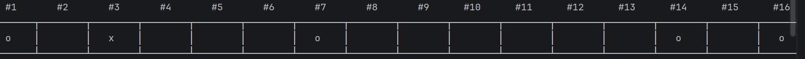
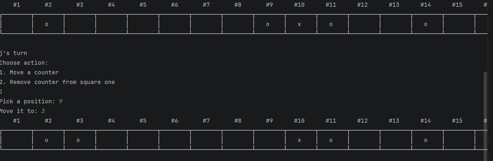
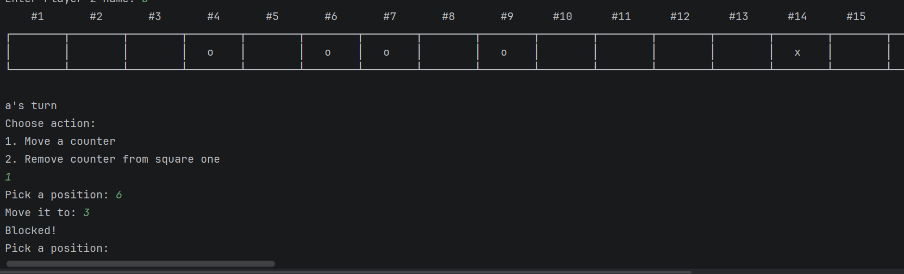
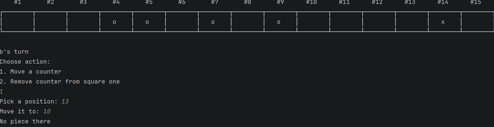
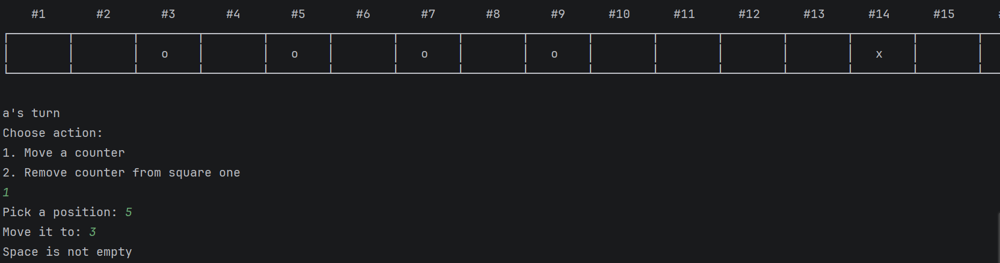
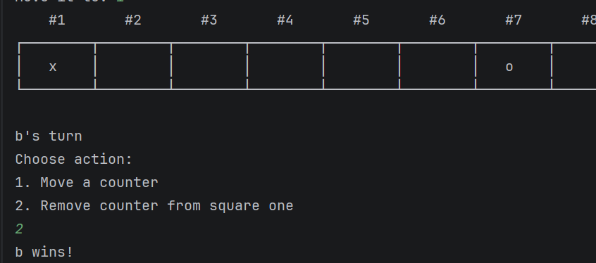
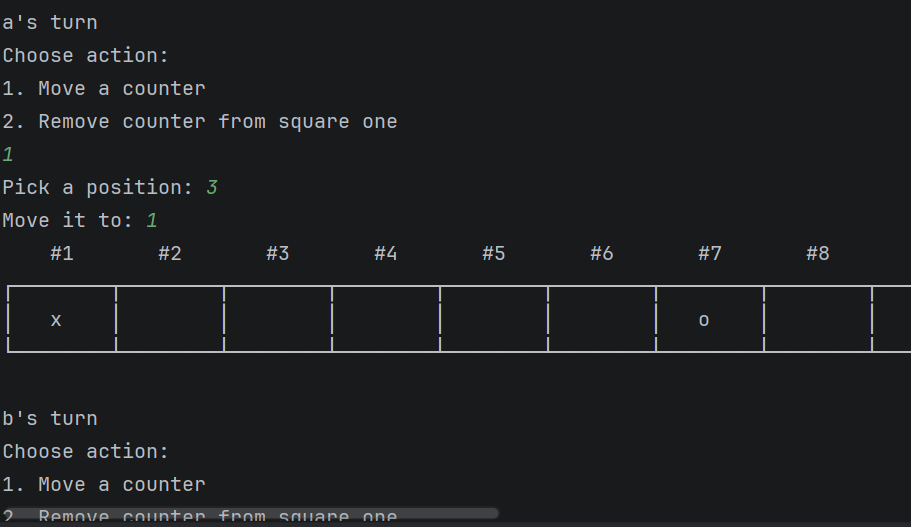
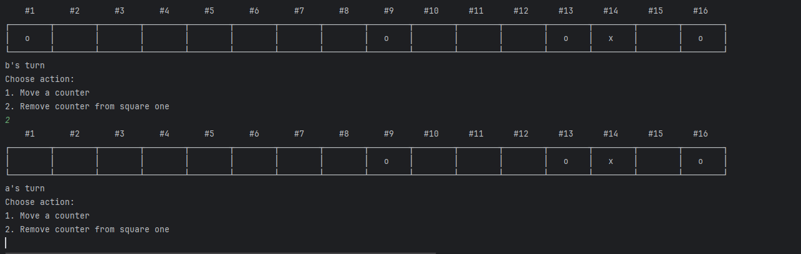
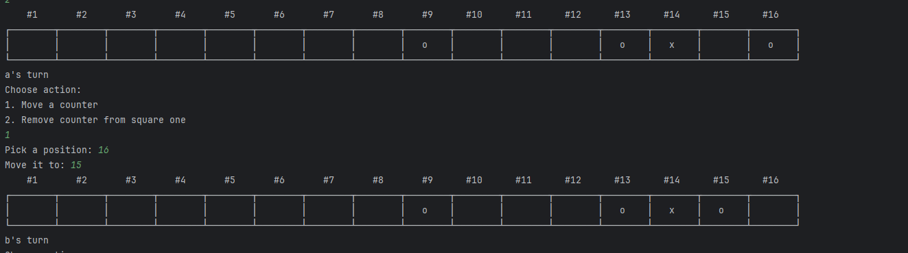
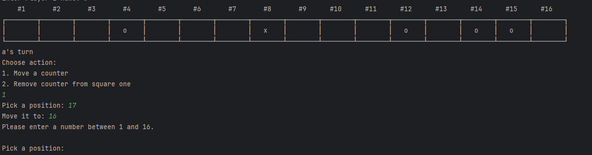

# Results of Testing

The test results show the actual outcome of the testing, following the [Test Plan](test-plan.md)

---

## List displaying correctly - GAMEPLAY

The list which contains the counters displays correctly with no inaccuracies.

### Test Data Used

The test data used was a list of 16 spaces with 4 "o" counters
and 1 "x" counter displayed randomly on the board to show that 
the code I used to show this is functional.

### Test Result

This test resulted in the list displaying the counters working perfectly as I had wanted it to.
It correctly displayed the counters, space numbers, and space borders.

---

## Valid Move - VALID

This test checks whether a player can successfully move a counter to a valid empty space following the rules of the game. The move must be within the board limits, must not jump over other counters, and must move into an empty space.
### Test Data Used

Player selected a valid counter position (e.g. square 12) and moved it to a lower-numbered empty square (e.g. square 8). Both inputs were within the range 1–16. The path between the two positions was clear.
### Test Result

Comment on test result. 
The counter successfully moved from the starting position to the selected empty space. The original position was cleared, and the destination was updated correctly. The board displayed the updated state correctly after the move.
---

---

## Blocked move test - INVALID

This test makes sure that the game correctly prevents a player from moving a counter through another counter. According to the rules, counters cannot jump over other counters, so any blocked path should stop the move from happening.
### Test Data Used

Player attempted to move a counter from one square far out on the board to another square closer to the start. There was at least one counter located between these positions, blocking the path.
### Test Result

Comment on test result. The program correctly detected the blocked path and displayed the message “Blocked!”. The move was not completed, and the board remained unchanged. This confirms that the collision detection logic is working correctly.

---

---

## Invalid Empty Space Test - INVALID

This test checks whether the program prevents a player from selecting an empty space as the piece to move. This ensures players cannot waste turns by moving non-existent counters.
### Test Data Used

Player selected a position that contained no counter (a blank space) as the starting position. A second valid position was also entered for the destination.
### Test Result

Comment on test result. The program correctly identified that no piece existed in the selected position and displayed the message “No piece there”. The move was cancelled and the player was prompted to try again without losing their turn.

---

---

## Invalid Destination Test - INVALID

This test checks whether the program prevents a player from moving a counter into an already occupied space. This ensures that counters cannot overlap.
### Test Data Used

Player selected a valid counter position but attempted to move it onto another occupied square.
### Test Result

Comment on test result. The program correctly detected that the destination square was already occupied and displayed “Space is not empty”. The move was cancelled and the board state remained unchanged.

---
---

## Win Condition Test - GAMEPLAY

This test ensures that the game correctly detects when the black counter ("x") is removed from square 1. This is the winning condition of the game.
### Test Data Used

The black counter was moved or positioned on square 1. The player then selected the option to remove the counter from square 1.
### Test Result

Comment on test result. The program correctly removed the black counter and immediately displayed the message showing the current player as the winner. The game loop ended successfully, confirming that win detection works as expected.

---
---

## Turn Switching Test - GAMEPLAY

This test ensures that the game correctly alternates between Player 1 and Player 2 after each valid move or action.
### Test Data Used

Both players took turns performing valid moves and actions (move or remove counter).
### Test Result

Comment on test result. The game correctly switched between Player 1 and Player 2 after each completed turn. The current player was displayed clearly before each action, confirming that the turn system works correctly.

---
---

## Removal of counter from square 1 - BOUNDARY

This test ensures that you can correctly remove a counter from square 1 with no boundary errors.

### Test Data Used

A player chooses the option to remove a counter from square 1.

### Test Result

The Code correctly removes the counter from square 1 upon the request. There is no error surrounding the boundary and the code works as expected.

---
---

## Moving counter from square 16 - BOUNDARY

This test makes sure that its possible to move a counter off of square 16 with no errors.

### Test Data Used

The player picks the counter on square 16 to move and places it in a valid position.

### Test Result

The code works as expected with no errors. It moves the counter off of square 16 to 15.

---
---

## Just Beyond Boundary Test - INVALID

This test makes sure that you can't enter a number just beyond the boundary and have it still work.
### Test Data Used

One of the players selects a value of either 0 or 17 and checks if it gives you the correct message in that it doesn't work.
### Test Result

The code does as expected and gives the player a message stating that they need to enter a number between 1 and 16 to ensure that the code doesnt mess up and take inputs beyond the boundaries.

---

